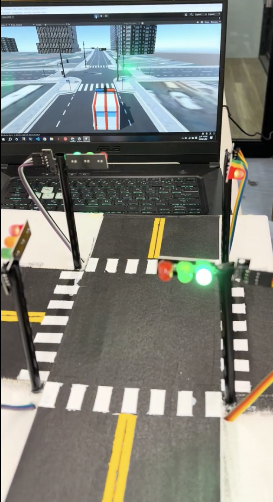
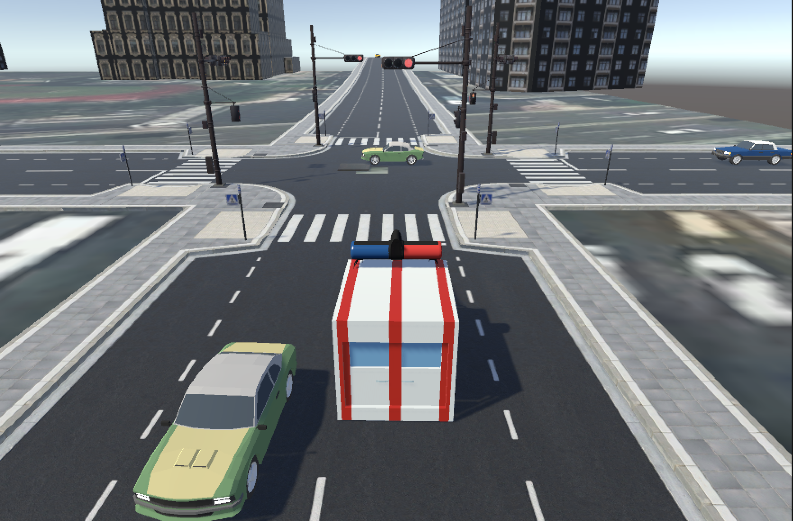
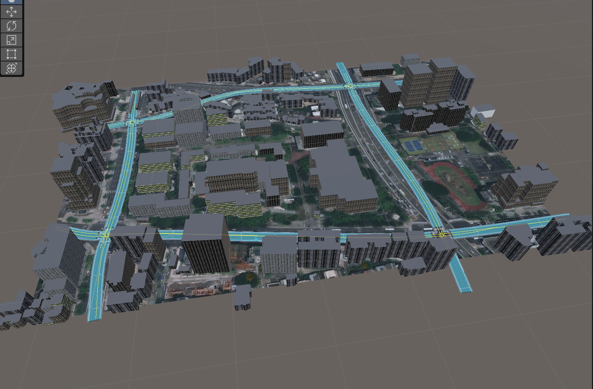

# CarSimulator-Optimized

這是以 [CarSimulatorWithCAN](https://github.com/ZAPEinthezone/CarSimulatorWithCAN) 為基礎的 Unity 車流模擬專題優化版。專案以一般車輛、救護車、交通號誌與路口互動為主；目前可從程式確認的硬體連線是 **Unity 經由序列埠傳送號誌狀態給 Arduino**。實體 CAN 封包的收發流程仍待整理與驗證，請勿將目前的序列埠同步誤認為已完成的 CAN 實作。

## 專題展示

本專題以 Unity 建立城市道路與車流模擬環境，整合救護車緊急模式、路口號誌優先控制、NPC 車輛避讓，以及 Arduino 實體交通號誌同步。當救護車接近路口時，系統會建立優先通行方向，並要求橫向與對向車輛在停止線前停等；救護車通過後，再恢復一般交通號誌與車流控制。

### Unity 與實體號誌同步

Unity 會讀取模擬場景中的交通燈狀態，透過序列埠將號誌資料傳送至 Arduino，使實體 LED 號誌能同步呈現紅、黃、綠燈狀態。此設計可用於展示虛實整合的智慧路口控制。



### 救護車優先通行與 NPC 車流

救護車進入緊急模式後，系統會偵測鄰近路口與車輛，調整路口通行權，並控制 NPC 車輛靠邊避讓、停止線停等或駛離路口中央，降低救護車受阻的情況。



### 城市道路模擬場景

場景以實際城市道路配置為參考，建立多個交叉路口、主要幹道、高架道路及周邊建築。道路節點與 NavMesh 導航共同控制車輛路線，作為交通號誌控制與緊急車輛優先系統的測試環境。



## 專案功能與流程

1. `NPC_CarSpawner` 在指定的 `TrafficNode` 生成一般車輛與救護車。
2. `NPC_WaypointDrive` 使用節點與 `NavMeshAgent` 控制一般車輛行駛，並處理前車偵測、紅燈停車和救護車避讓。
3. `NPC_AmbulanceDrive` 控制救護車的緊急模式、警笛、路線選擇及附近車輛通知。
4. `IntersectionV2X` 在緊急情境調整路口燈號與附近車輛行為，之後恢復原狀。
5. `ArduinoUnityTrafficSync` 讀取 Unity 內的燈號狀態，透過序列埠將狀態送往 Arduino；不接硬體時，車流模擬仍可獨立檢查。

## 專案架構

```text
CarSimulator-Optimized/
├── Assets/
│   ├── Scenes/                 # 場景，例如 SampleScene.unity
│   ├── Prefabs/                # 車輛、救護車、號誌等預製物件
│   ├── Scripts/
│   │   ├── Car/                # 車輛生成、行駛、救護車與路口 V2X
│   │   ├── Traffic/            # TrafficNode 路線節點
│   │   └── ArduinoUnityTrafficSync.cs
│   └── ...                     # 模型、材質、聲音與其他素材
├── Packages/                   # Unity Package Manager 套件清單
└── ProjectSettings/            # Unity 專案設定與版本
```

主要腳本還包括 `PathAutoLinker`（節點連結）、`LightManager`／`CopLight`（警示燈）及 `AmbulanceCameraFollow`（攝影機跟隨）。

## 開發環境與套件

- Unity Editor：**2022.3.62f3**（以 `ProjectSettings/ProjectVersion.txt` 為準）。
- 程式語言：C#；車輛導航使用 Unity `NavMeshAgent`。
- 下表是 `Packages/manifest.json` 宣告的主要 Unity Package Manager 套件；安裝與解析由 Unity Editor 處理。

| 套件 | 版本 | 用途／備註 |
| --- | --- | --- |
| AI Navigation (`com.unity.ai.navigation`) | 1.1.7 | 導航與 NavMesh 相關功能 |
| Input System (`com.unity.inputsystem`) | 1.14.2 | 輸入系統套件 |
| TextMeshPro (`com.unity.textmeshpro`) | 3.0.7 | 文字顯示 |
| Timeline (`com.unity.timeline`) | 1.7.7 | 時間軸功能 |
| Unity UI (`com.unity.ugui`) | 1.0.0 | UI 元件 |
| Visual Scripting (`com.unity.visualscripting`) | 1.9.4 | 視覺化腳本套件 |
| Version Control (`com.unity.collab-proxy`) | 2.11.3 | Unity 版本控制整合 |
| Development Feature (`com.unity.feature.development`) | 1.0.1 | 開發功能組合 |

`manifest.json` 另外列有 Unity 內建模組；上表表示專案宣告的依賴，**不代表每個套件都已由目前的 C# 腳本直接使用**。

### 第三方素材

`Assets/` 中另有車輛模型、交通燈、地圖及其他素材。原儲存庫的 `.gitignore` 排除了 `EasyRoads3D`、`EasyRoads3D Assets`、`EasyRoads3D Scenes` 三個資料夾，因此從 GitHub 複製專案後，這些素材不會自動出現；相關場景或物件可能無法完整還原。請依素材授權取得與安裝，不要直接上傳未確認授權的第三方內容。

首次在新電腦或新副本開啟時，若 Unity 的 Project 視窗中這三個資料夾是空的，需重新匯入 EasyRoads3D：

1. 使用有權取得該素材的 Unity 帳號，在 **Window > Package Manager > My Assets** 找到對應套件，下載後按 **Import**；若已有合法取得的 `.unitypackage`，也可用 **Assets > Import Package > Custom Package** 選取檔案。
2. 在匯入清單中檢查將加入的素材。若套件包含整個 Demo Project，避免覆蓋目前專案的 `ProjectSettings`、`Assets/Scenes` 或其他同名檔案。
3. 匯入後確認 EasyRoads3D 資料夾有實際內容，再重新開啟主場景檢查道路與 Console 訊息。同一份專案只需匯入一次；重建 `Library/` 不會刪除 `Assets/` 中的素材。

操作細節可參考 [Unity 2022.3 的 Asset Store 套件匯入說明](https://docs.unity3d.com/cn/2022.3/Manual/upm-ui-import.html)與[本機 `.unitypackage` 匯入說明](https://docs.unity3d.com/cn/2022.3/Manual/AssetPackagesImport.html)。

## 開啟與測試

1. 在 Unity Hub 選擇 **Add project from disk**，指定本儲存庫根目錄（含 `Assets/`、`Packages/`、`ProjectSettings/`）。
2. 使用 Unity **2022.3.62f3** 開啟。首次開啟可能需要重建 `Library/` 並重新匯入素材。
3. 在 Project 視窗手動開啟 `Assets/Scenes/SampleScene.unity`，再按 Play 檢查車流。`EditorBuildSettings` 目前未列入任何場景，不能直接假設 Build 已設定完成。
4. 若要測試 Arduino 交通燈同步，先連接硬體，並在掛載 `ArduinoTrafficLightAutoSync` 的物件上將 `portName` 設為實際序列埠。腳本預設為 Windows 的 `COM5`、`9600` baud；macOS 需改成對應的 `/dev/...` 裝置名稱。

建議將工作專案放在不會自動卸載本機檔案的位置，避免 iCloud 等雲端同步把 Unity 所需的素材變成尚未下載的佔位檔。

## 空間與快取

- `Library/` 是 Unity 產生的快取；在 **Unity 已關閉** 且專案可正常開啟後，舊的 `Library_backup_*` 可刪除以騰出空間。目前使用中的 `Library/` 不必定期刪除，刪除後會花時間重新匯入。
- Asset Store 的 `.unitypackage` 下載快取與已匯入 `Assets/` 的素材是兩份不同檔案。確認專案可正常開啟後，快取檔可自行清理；日後若要重新匯入，可能需要再次下載。
- 清理舊專案副本前，先確認目前工作版的場景與素材完整，並保留自己尚未提交的變更。

## 目前狀態與限制

- 已針對 NPC 避讓時的路徑更新，以及救護車通知附近車輛的頻率做小幅調整；尚未完成 Unity 執行與 FPS 前後比較。
- 原資料夾曾遇到 iCloud 檔案未完整下載與 Unity `Library` 重建問題。若 Unity 顯示版本不符或檔案損壞，先確認 `ProjectSettings/ProjectVersion.txt` 與素材都已下載完整，再檢查 Console 訊息。
- `Library/`、`Temp/`、`Logs/` 等 Unity 產生檔不應提交到 Git。
